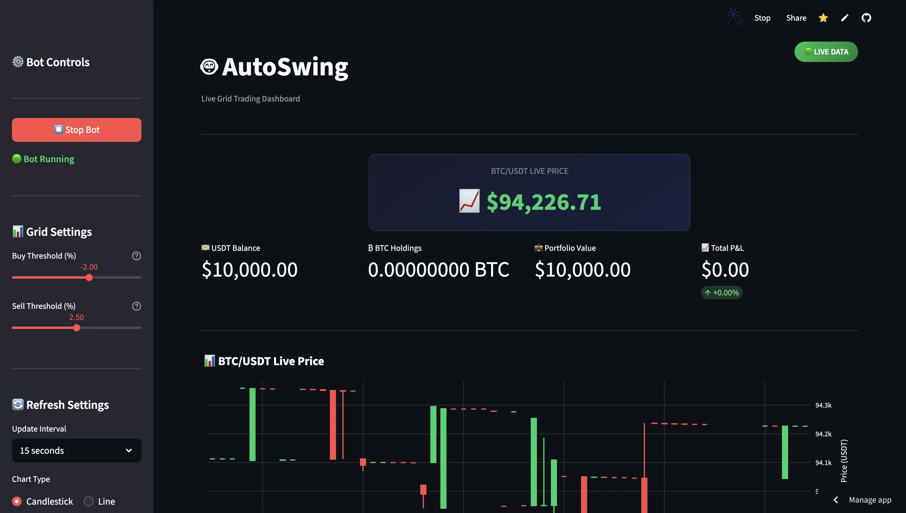

# 🤖 AutoSwing Trading Suite
### Live Grid Trading Dashboard (Simulated)



[](https://autoswing.streamlit.app/)
[](https://www.python.org/downloads/release/python-3100/)
[](https://github.com/shaurya-ahuja/autoswing-trading-suite)

**AutoSwing** is a powerful educational trading dashboard that lets you experience algorithmic trading **risk-free**. 

It connects to **Real-Time Market Data** (Binance or Binance.US) but executes trades in a completely **Simulated Environment**. This allows you to test Grid Trading strategies against real-world volatility without ever risking a single penny.

---

## ✨ Features

- **🛡️ 100% Safe Simulation**: The code is physically incapable of placing real orders. Funds are safe.
- **📊 Real-Time Mainnet Data**: Use your API keys to see *actual* market prices, not fake data.
- **🇺🇸 Binance.US Support**: Fully compatible with Binance.US for users in restricted regions.
- **📉 Visual Trading Log**: See Buy/Sell execution on the chart and in a detailed log.
- **⚙️ Adjustable Strategies**: Tweak Buy/Sell thresholds (down to 0.01%) to test rapid-fire scalping.
- **📱 Mobile Friendly**: Responsive design powered by Streamlit.

---

## 🚀 Quick Start (Free Cloud Deployment)

You can run this dashboard 100% free on **Streamlit Cloud**.

### 1. Fork this Repo
Click the **Fork** button in the top right to get your own copy of this code.

### 2. Deploy on Streamlit
1. Go to [share.streamlit.io](https://share.streamlit.io/) and Sign In.
2. Click **New App** -> Select your forked repository.
3. Set Main file path: `swinggrid/app.py`
4. Click **Deploy!**

### 3. Connect to Real Data (Securely)
Once deployed, the app will show "🔒 SANDBOX MODE" (Testnet data). To switch to **Real Data**:

1. Go to your App Dashboard -> **Settings** -> **Secrets**.
2. Paste the following configuration (choose the one for your region):

#### 🌍 Global Users (Binance.com)
```toml
[binance]
api_key = "YOUR_GLOABL_API_KEY"
api_secret = "YOUR_GLOBAL_API_SECRET"
product_mode = true
use_binance_us = false
```

#### 🇺🇸 US Users (Binance.US)
```toml
[binance]
api_key = "YOUR_US_API_KEY"
api_secret = "YOUR_US_API_SECRET"
product_mode = true
use_binance_us = true  # <--- Important!
```

*Note: Your keys are stored securely by Streamlit. The app only uses them to READ prices.*

---

## 🛠️ Local Installation

If you prefer running it on your own machine:

1. **Clone the repo:**
   ```bash
   git clone https://github.com/shaurya-ahuja/autoswing-trading-suite.git
   cd autoswing-trading-suite
   ```

2. **Install dependencies:**
   ```bash
   pip install -r swinggrid/requirements.txt
   ```

3. **Configure Secrets:**
   Create a file `swinggrid/.streamlit/secrets.toml` with the configuration from step 3 above.

4. **Run the App:**
   ```bash
   cd swinggrid
   streamlit run app.py
   ```

---

## 📂 Project Structure

```bash
autoswing-trading-suite/
├── README.md               # You are here
├── requirements.txt        # Project dependencies
└── swinggrid/              # Main Dashboard Code
    ├── app.py              # Streamlit Application Entry
    ├── binance_client.py   # Real Data Connector (Safe Mode)
    ├── grid_strategy.py    # Isolated Trading Logic
    ├── config.py           # Configuration Constants
    ├── utils.py            # Charting & Formatting Helpers
    └── assets/             # Images & Mockups
```

---

## ⚠️ Disclaimer

This software is for **EDUCATIONAL PURPOSES ONLY**. 
While it uses real market data, all trading execution is **SIMULATED**. 
The authors take no responsibility for any financial decisions made based on this tool. Always trade responsibly.

---

### 👨‍💻 Developed by AutoSwing Team
