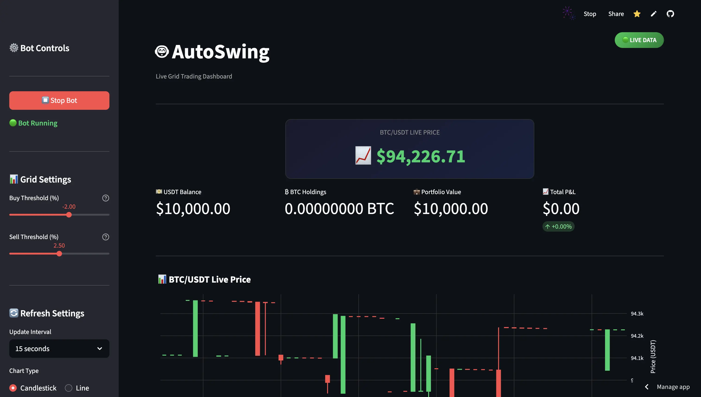

# AutoSwing Trading Suite

A real-time market data pipeline and grid-strategy backtester. Ingests live Binance WebSocket tick data, runs a pluggable strategy engine against it, and surfaces PnL, drawdown, and trade metrics in a Streamlit dashboard. All execution is simulated; the system only reads market data.

Live demo: [autoswing.streamlit.app](https://autoswing.streamlit.app/)



---

## What it does

1. **Market data ingestion.** Subscribes to Binance spot WebSocket streams (trade + bookTicker channels) and normalizes events into a uniform tick schema. Global and Binance.US endpoints are both supported.
2. **In-memory tick buffer.** Incoming ticks are written to a bounded ring buffer so strategy evaluation runs against the most recent N events without unbounded memory growth.
3. **Strategy engine.** Pluggable strategies consume normalized ticks and emit order intents. The reference implementation is a grid strategy with configurable band width, rung spacing, position sizing, and take-profit / stop-loss rules.
4. **Simulated matching.** Order intents are filled against the latest observed price with a configurable slippage and fee model. Fills feed a position tracker that maintains running PnL.
5. **Analytics.** The analytics layer computes realized and unrealized PnL, trade count, win rate, and running drawdown. Results render live in Streamlit and are dumped to CSV for offline analysis.
6. **Backtest mode.** The same strategy engine can be replayed against recorded tick data so parameter sweeps are reproducible and not dependent on live network conditions.

End-to-end latency from WebSocket event to dashboard update is well under a second on a laptop; the hot path avoids blocking I/O and copies.

---

## Architecture

```
                   +----------------------+
  Binance WS ----> | exchange_client.py   |  normalize ticks
                   +----------+-----------+
                              |
                              v
                   +----------------------+
                   | ring buffer (ticks)  |
                   +----------+-----------+
                              |
                              v
                   +----------------------+
                   | grid_strategy.py     |  subclass BaseStrategy
                   +----------+-----------+
                              |
                              v
                   +----------------------+
                   | simulated matcher    |  slippage + fees
                   +----------+-----------+
                              |
                              v
        +---------------------+---------------------+
        | position tracker  |  analytics (PnL/DD)   |
        +---------------------+---------------------+
                              |
                              v
                   +----------------------+
                   | swinggrid/app.py     |  Streamlit UI
                   +----------------------+
```

Strategies subclass `BaseStrategy` and implement `on_tick(tick) -> list[OrderIntent]`. Adding a new strategy does not require changes anywhere else in the pipeline.

---

## Repo layout

```
autoswing-trading-suite/
├── exchange_client.py          # WebSocket client + tick normalization
├── trading_bots.py             # Strategy loop + simulated matching
├── telegram_controller.py      # Optional control channel (start/stop/status)
├── test_real_data_logic.py     # Tests against recorded market data
├── requirements.txt
└── swinggrid/
    ├── app.py                  # Streamlit dashboard entry point
    ├── binance_client.py       # Read-only market data client
    ├── grid_strategy.py        # Grid strategy implementation
    ├── config.py               # Tunable constants
    ├── utils.py                # Chart + formatting helpers
    └── assets/                 # Screenshots
```

---

## Running locally

```bash
git clone https://github.com/shaurya-ahuja/autoswing-trading-suite.git
cd autoswing-trading-suite
pip install -r swinggrid/requirements.txt
cd swinggrid
streamlit run app.py
```

By default the app runs against Binance testnet data so no credentials are required. To point at live mainnet data (still read-only, no order placement), create `swinggrid/.streamlit/secrets.toml`:

```toml
[binance]
api_key = "YOUR_KEY"
api_secret = "YOUR_SECRET"
product_mode = true
use_binance_us = false    # set true for Binance.US
```

Credentials are used only to read market data. The simulated matcher never submits real orders.

---

## Running the tests

```bash
pytest test_real_data_logic.py
```

The test suite replays recorded tick sequences through the strategy and matching layers and asserts on expected fills, PnL, and drawdown for known parameter sets. This is how the backtest path is kept honest across refactors.

---

## Deploying on Streamlit Cloud

1. Fork this repo.
2. Go to [share.streamlit.io](https://share.streamlit.io/), connect your fork.
3. Set the main file path to `swinggrid/app.py` and deploy.
4. Add the `secrets.toml` block above under Settings > Secrets if you want mainnet data.

---

## Notes and limitations

- All execution is simulated. There is no code path that places real orders on any exchange.
- The grid strategy is intentionally simple. It is useful as a reference implementation, not as a profitable strategy.
- Latency numbers cited above are measured on a consumer laptop on residential internet. Real colocation latency is a different problem.
- Fee and slippage models are first-order approximations and do not account for queue position, partial fills, or market-impact curves.

---

## Disclaimer

For educational use only. Nothing in this repository constitutes financial advice.
